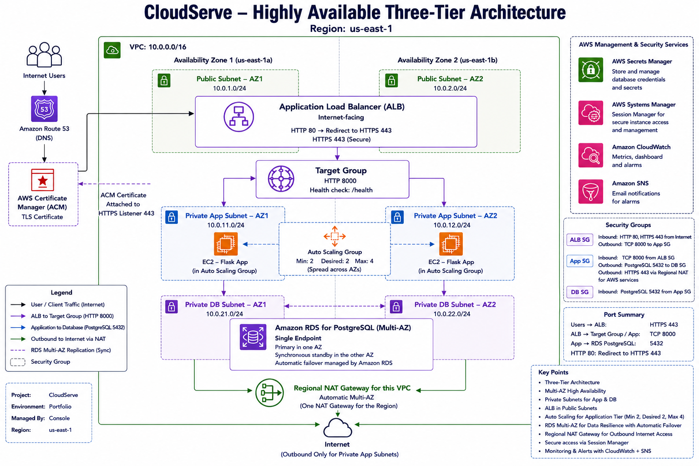

# CloudServe – Highly Available 3-Tier Architecture on AWS

CloudServe is a production-style customer order and support portal deployed on AWS using a secure and highly available three-tier architecture.

The project demonstrates the design, deployment, troubleshooting and validation of a cloud architecture that separates the web, application and database layers across multiple Availability Zones.

## Architecture Overview

The architecture is divided into three main tiers:

- **Web Tier:** An Application Load Balancer deployed across public subnets receives and distributes incoming traffic.
- **Application Tier:** A Python Flask application runs on Amazon EC2 instances in private subnets and is managed through an Auto Scaling Group.
- **Database Tier:** Amazon RDS for PostgreSQL runs in private database subnets using a Multi-AZ deployment.

## Architecture Diagram

## Project Objectives

- Design a secure and highly available AWS architecture.
- Separate the web, application and database tiers.
- Deploy a Python Flask application on Amazon EC2.
- Distribute traffic through an Application Load Balancer.
- Use an Auto Scaling Group across multiple Availability Zones.
- Deploy Amazon RDS for PostgreSQL using Multi-AZ.
- Restrict communication between tiers using security groups.
- Store database connection details securely using AWS Secrets Manager.
- Validate application health and database connectivity.
- Document the implementation, troubleshooting process and lessons learned.

## AWS Services Used

- Amazon VPC
- Public and private subnets
- Internet Gateway
- NAT Gateway
- Application Load Balancer
- Amazon EC2
- Auto Scaling Group
- Amazon RDS for PostgreSQL
- AWS Secrets Manager
- AWS Systems Manager Session Manager
- Amazon CloudWatch
- AWS Budgets

## Key Features

- Multi-AZ network design
- Load-balanced application traffic
- EC2 instances hosted in private subnets
- Auto Scaling Group for application availability
- Multi-AZ PostgreSQL database
- Restricted security group communication
- Secure database credential management
- Application and database health validation
- Cost monitoring and budget alerts

## Implementation

The infrastructure was initially deployed manually through the AWS Management Console to develop a practical understanding of each service and its configuration.

Implementation details are available in:

[Implementation Guide](docs/implementation-guide.md)

## Testing and Validation

The completed deployment was validated by:

- Confirming that EC2 instances were healthy behind the Application Load Balancer.
- Testing the application health endpoint.
- Verifying connectivity between the Flask application and PostgreSQL database.
- Confirming that application instances were distributed across Availability Zones.
- Reviewing network routes and security group communication.
- Troubleshooting deployment issues involving user data, application ports and database configuration.

## Lessons Learned

The project included practical troubleshooting across networking, application deployment, load balancing and database connectivity.

A summary of the main challenges, solutions and improvements is available in:

[Lessons Learned](docs/lessons-learned.md)

## AWS Region

`us-east-1`

## Future Improvements

- Rebuild the infrastructure using Terraform.
- Add HTTPS using AWS Certificate Manager.
- Add automated deployment through a CI/CD pipeline.
- Improve monitoring and alerting.
- Perform additional resilience and failure-recovery testing.

## Project Status

✅ **Completed** – The architecture has been designed, deployed, tested and documented.
